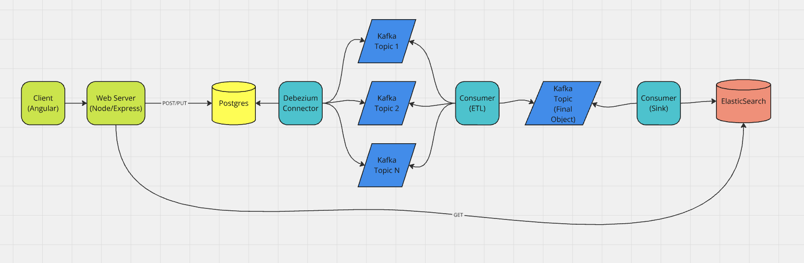

# Delivery System Manager



## Introduction

This is a demo that has several applications orchestrated to work as a whole. Conceptually, Deliveries are created using a web app and saved to a Postgres DB. A Debezium connector running with Confluent Kafka then captures the data changes and sends them to Kafka topics in a Kafka cluster. A consumer is listening to some of these topics and ETLing them into a "clean" delivery representation. A ksqlDB materialized view then "flattens" these representations into a final Delivery object, which is sent to a topic and a final consumer sends this object to ElasticSearch. So the App breakdown is as follows:

- Web Client Application (Angular) - Not yet implemented.
- Web Service Application (Node Express) - Some general endpoints for getting and setting delivery data using the Sequelize ORM for Node.
- Kafka Cluster - 3 nodes using the confluent cloud kafka image
- Kafka Debezium CDC Connector- See the Confluent Connector notes for implementation details.
- Kafka Stream Consumer (ETL) - Node app listening for new messages and putting them in "clean" topics.
- Kafka kSQLDB Materialized View - combines multiple topic streams into a final delivery topic.
- Kafka Stream Consumer (ElasticSearch Sink) - gets this final delivery and upserts it into ElasticSearch, ensuring any creates or updates only result in a single document in the deliveries index in ElasticSearch.

## Getting Started.

### Delivery Details

This app creates a basic delivery that belongs to an order. a delivery can have multiple attempts, and each attempt has multiple state changes. the state changes propagate updates to the attempts and delivery tables `status` column. So, if we get a new state change record for Delivery 1's Attempt 3 of state "Delivered", we save the state change record, associating it to attempt 3 (which is associated to delivery 1), and we update the `status` column of Attempt 3 and Delivery 1 to "Delivered."

- All 3 of these table changes (1 CREATE and 2 UPDATES) are captured by debezium and added to their respective topics. The consumer receieves these messages, parses them to update the existing delivery hash in redis with the new status.

### Prerequisites

- Node 18+ required for development.
- Docker

### Docker Compose

The Docker compose file has pretty much everything you need to get started. Double check the exposed ports to avoid collisions.

### Confluent Connector

Once the compose has been `upped`, We need to POST to the connector endpoint to register the debezium connector to our Kafka cluster.

- URL:
  `http://localhost:8083/connectors`
- POST Body:

```
  {
    "name": "delivery-connector",
    "config": {
      "connector.class": "io.debezium.connector.postgresql.PostgresConnector",
      "database.hostname": "host.docker.internal",
      "database.port": "5432",
      "database.user": "postgres",
      "database.password": "example",
      "database.dbname": "postgres",
      "database.server.name": "postgres",
      "topic.prefix": "data",
      "plugin.name":  "pgoutput"
    }
  }
```

### ElasticSearch

1. Create an Index called `fulldelivery` in Kibana.
2. navigate to `http://localhost:5601/`.
3. Select Search > Indices.
4. Click Create a new index button.
5. Use the name `fulldelivery` and click `Create index`.

### ksqlDB Streams and Materialized Views

1. Creating the streams allows us to run ksql on topics.

```
  -- Creating the deliveries stream;
    CREATE STREAM deliveries (
      id BIGINT,
      delivery_type VARCHAR,
      notes VARCHAR,
      status VARCHAR,
      dispatch_at VARCHAR,
      created_at VARCHAR,
      updated_at VARCHAR,
      mileage INT,
      order_id BIGINT,
      tx_id BIGINT,
      op VARCHAR)
    WITH (kafka_topic='deliveries', value_format='json');
```

```
  -- Creating the orders stream;
  CREATE STREAM orders (
    id BIGINT,
    organization_id BIGINT,
    created_at VARCHAR,
    updated_at VARCHAR,
    tx_id BIGINT,
    op VARCHAR)
  WITH (kafka_topic='orders', value_format='json');
```

```
  -- Creating the deliveryDetails stream;
  CREATE STREAM deliveryDetails (
    id BIGINT,
    from_instructions VARCHAR,
    from_contact_name VARCHAR,
    to_instructions VARCHAR,
    to_contact_name VARCHAR,
    from_address VARCHAR,
    from_city VARCHAR,
    from_state VARCHAR,
    from_zip VARCHAR,
    from_country VARCHAR,
    from_phone_number VARCHAR,
    to_address VARCHAR,
    to_city VARCHAR,
    to_state VARCHAR,
    to_zip VARCHAR,
    to_country VARCHAR,
    to_phone_number VARCHAR,
    created_at VARCHAR,
    updated_at VARCHAR,
    delivery_id BIGINT,
    tx_id BIGINT,
    op VARCHAR)
    WITH (kafka_topic='delivery_details', value_format='json');
```

2. Creating a table (AKA Materialized View) Allows us to view data (and join streams) in dynamic ways and sends this view of the data to the final topic.

```
-- create a table that joins the deliveries, delivery_details, and orders streams;
  CREATE TABLE fullDelivery AS
  SELECT deliveries.id,
    LATEST_BY_OFFSET(deliveries.id) AS delivery_id,
    LATEST_BY_OFFSET(deliveries.delivery_type) AS delivery_type,
    LATEST_BY_OFFSET(deliveries.notes) AS notes,
    LATEST_BY_OFFSET(deliveries.status) AS status,
    LATEST_BY_OFFSET(deliveries.dispatch_at) AS dispatch_at,
    LATEST_BY_OFFSET(deliveries.created_at) AS created_at,
    LATEST_BY_OFFSET(deliveries.updated_at) AS updated_at,
    LATEST_BY_OFFSET(deliveries.mileage) AS mileage,
    LATEST_BY_OFFSET(deliveries.order_id) AS order_id,
    LATEST_BY_OFFSET(orders.organization_id) AS organization_id,
    LATEST_BY_OFFSET(deliveryDetails.from_instructions) AS from_instructions,
    LATEST_BY_OFFSET(deliveryDetails.from_contact_name) AS from_contact_name,
    LATEST_BY_OFFSET(deliveryDetails.to_instructions) AS to_instructions,
    LATEST_BY_OFFSET(deliveryDetails.to_contact_name) AS to_contact_name,
    LATEST_BY_OFFSET(deliveryDetails.from_address) AS from_address,
    LATEST_BY_OFFSET(deliveryDetails.from_city) AS from_city,
    LATEST_BY_OFFSET(deliveryDetails.from_state) AS from_state,
    LATEST_BY_OFFSET(deliveryDetails.from_zip) AS from_zip,
    LATEST_BY_OFFSET(deliveryDetails.from_country) AS from_country,
    LATEST_BY_OFFSET(deliveryDetails.from_phone_number) AS from_phone_number,
    LATEST_BY_OFFSET(deliveryDetails.to_address) AS to_address,
    LATEST_BY_OFFSET(deliveryDetails.to_city) AS to_city,
    LATEST_BY_OFFSET(deliveryDetails.to_state) AS to_state,
    LATEST_BY_OFFSET(deliveryDetails.to_zip) AS to_zip,
    LATEST_BY_OFFSET(deliveryDetails.to_country) AS to_country,
    LATEST_BY_OFFSET(deliveryDetails.to_phone_number) AS to_phone_number
  FROM deliveries
    INNER JOIN orders WITHIN 2 HOURS ON deliveries.order_id = orders.id
    INNER JOIN deliveryDetails WITHIN 2 HOURS ON deliveries.id = deliveryDetails.delivery_id
  GROUP BY deliveries.id
  EMIT CHANGES;
```

### Known Issues

- The Kafka Consumer currently has issues running in a container, so I've been running it locally. Working on fixing this.
- The default API key for ElasticSearch does not work out of the box as expected. The current workaround is to log into Kibana (`http://localhost:5601`). login credentials are in the .ENV file), search for API Keys at the top, add a manual one (default all options), copy it and replace the existing value in the `./kafka-consumer/src/elasticsearch-service.ts` file with the new one before running the consumer.

### Suggested Reading and reference material

- [Sequelize](https://sequelize.org/)
- [Kafka Tutorial](https://medium.com/@parasharprasoon.950/how-to-set-up-cdc-with-kafka-debezium-and-postgres-70a907b8ca20)
- [Redis Documentation](https://redis.io/docs/latest/develop/)
